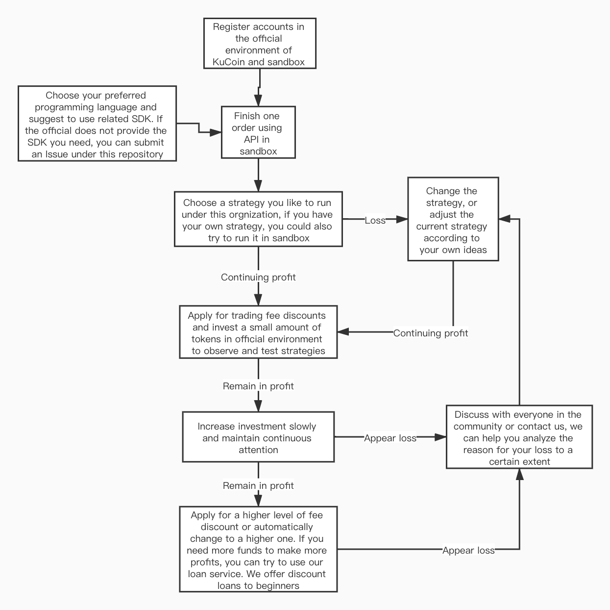

# Guide
    This project is supported by KuCoin and is maintained by community trading enthusiasts. It is used to guide more people to earn "after sleep" income by doing quantitative trading in the digital currency market.
Here is a simple flow chart for getting started:  

Hope the following introductory article that explains some simple logic of quantitative trading could help you get started:  

[letter](letter.md)  

  

The following are some simple strategies, some of which have only text descriptions and instructions, and some strategies have implemented a simple demo (just a simple demo, there will be many bugs, optimize the strategies to continue making money), for reference only:  

[Simple_grid_strategy](https://github.com/Kucoin-academy/simple-grid)

[Shock_strategy](https://github.com/Kucoin-academy/shock-strategy)

[Bollinger_strategy](https://github.com/Kucoin-academy/bollinger-strategy)

[Avg_position_strategy](https://github.com/Kucoin-academy/avg-position)

[High_frequency_Calendar_Spread_Arbitrage](https://github.com/Kucoin-academy/high-frequency)

[High_frequency_futures_cash_arbitrage](https://github.com/Kucoin-academy/spot-contract)

[期现套利策略](https://github.com/Kucoin-academy/spot-contract)

[三角套利策略](https://github.com/Kucoin-academy/triangle-arbitrage)

[定投策略](https://github.com/Kucoin-academy/aip-strategy)

[倍投策略](https://github.com/Kucoin-academy/double-strategy)

