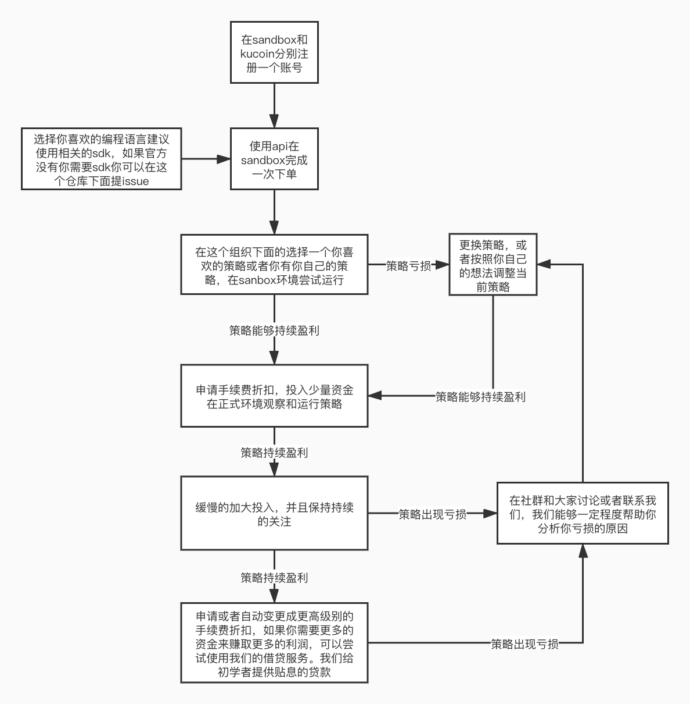

# guide
    这个项目是由kucoin支持，社群交易爱好的维护的项目，用于引导更多的人通过在数字货币做量化交易来赚取”睡后“收入。
下面是一个简易的入门流程图

这里还有一篇入门的文章阐述一些简单的逻辑希望能够帮助到你入门

[letter](letter.md)

下面是一些简单的策略，有些策略只有文字描述和说明，有些策略我们实现了简单的demo（只是简单的demo会有很多bug，要想持续赚钱还需要自己优化），供大家参考使用

[简单网格策略](https://github.com/Kucoin-academy/simple-grid)

[震荡突破策略](https://github.com/Kucoin-academy/shock-strategy)

[布林强盗突破策略](https://github.com/Kucoin-academy/bollinger-strategy)

[均仓策略](https://github.com/Kucoin-academy/avg-position)

[高频跨期套利策略](https://github.com/Kucoin-academy/high-frequency)

[高频期现套利策略](https://github.com/Kucoin-academy/spot-contract)

[期现套利策略](https://github.com/Kucoin-academy/spot-contract)

[三角套利策略](https://github.com/Kucoin-academy/triangle-arbitrage)

[定投策略](https://github.com/Kucoin-academy/aip-strategy)

[倍投策略](https://github.com/Kucoin-academy/double-strategy)

